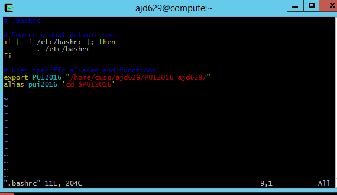
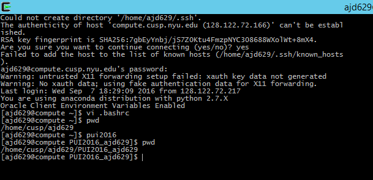

For the first part of the assignment, I took assistance from Vishwajeet Shelakar. 
He helped me with resolving my merge conflict in the lab work. 
I worked with Avikal Somwanshi to fork his repository. Vishwajeet helped me understand the difference between cloning and forking

For the second part of the assignment, I set up the enviornment. I referred google to understand the syntax of the export command and the alias command.

 
  

