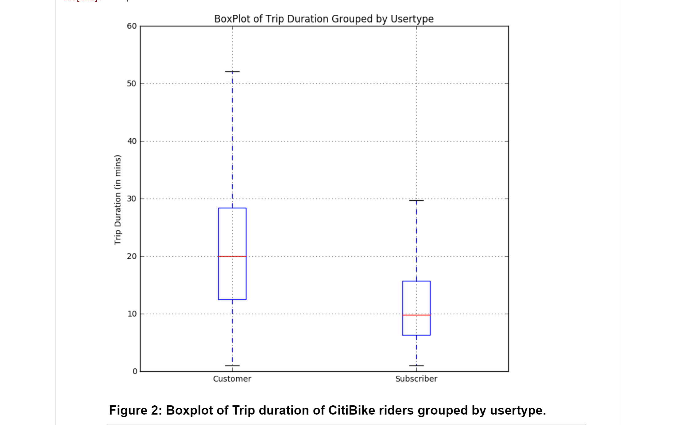
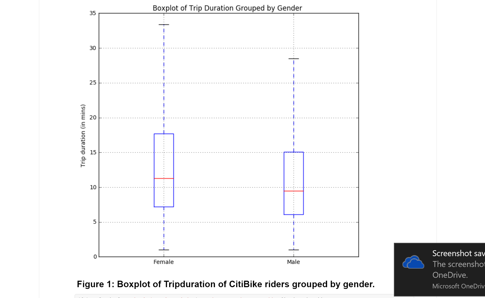
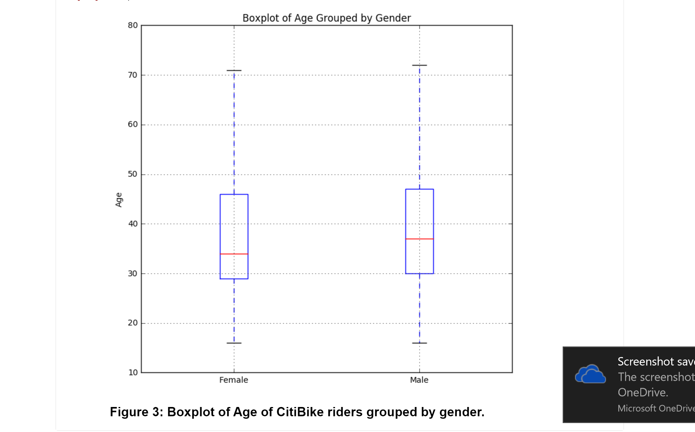

### Hey Aaron,

I appreciate your idea to come up with something new like boxplot. The graph is comprehensible enough to convey the information, 
however it would be better to see your conculsion included as the caption of your plot(few lines about what you interpret of your plot).

Also,using Boxplot is a good and very useful way to identify outliers in your data. The graph would be more useful if you would specify the median using text. Overall the plot is clear in size and aesthetically good.
Good job Aaron.

