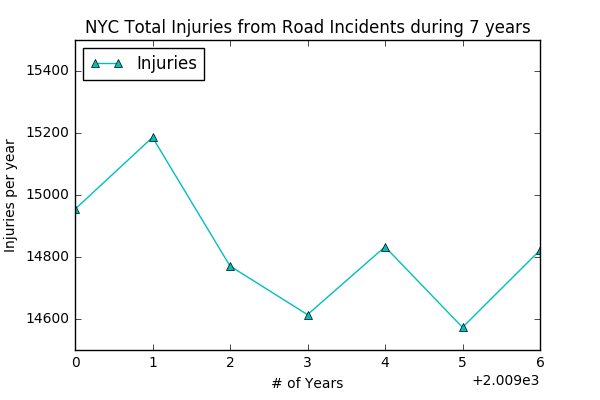

## Peer Review for HW7 Plot

### Plot

### Review

The data processing for your file is very clearly written and since you have not dropped any value, I can say that the plot can be reproduced without any difficulty. The plot made by you for the HW7 is absolutely clear with a title, labels and the legend. I particularly liked the symbol used in the plot which highlights perfectly the coordinates of the measurements. 

Although the plot is well designed, I would recommend changing the x axis scale to values given as 2009 - 2015 in increments of 1 year. Also, it would be clearer to use Number of years instead of #, to minimize any ambiguity in the meaning. 

Again, nice work with the plot.

Reviewer : ajd629
