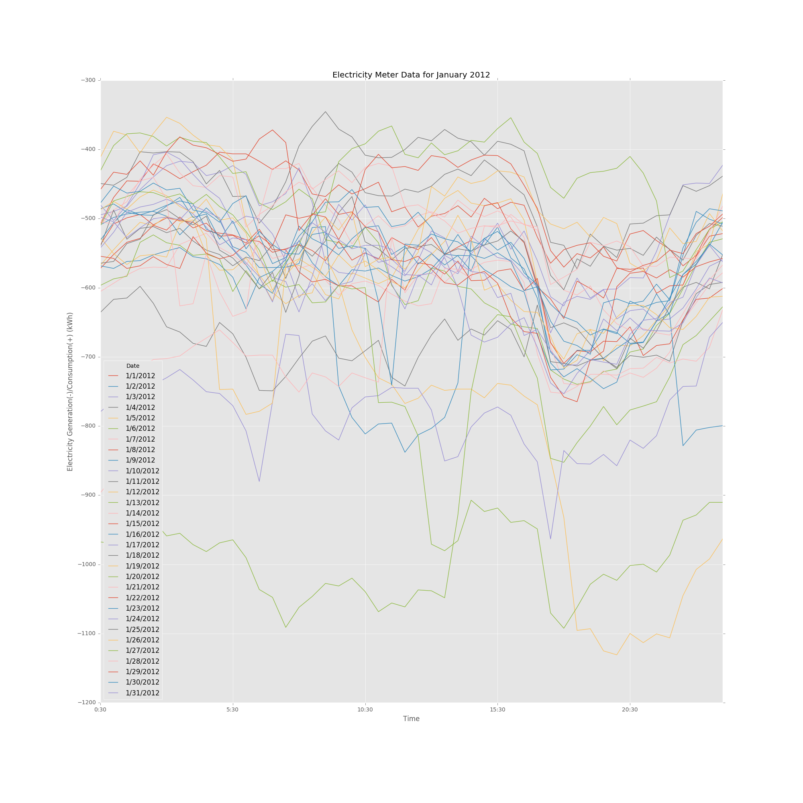

## Peer Review for HW7 Plot

### Plot

### Review

The data processing part of the file is not available in your repository, hence, I cannot review the reproducabilty of your plot.

The plot is constructed with all the necessary elements. But, I would recommended using another type of graph, perhaps a sparkline graph to plot your data. The information together is very difficult to interpret and compare, and i think sparkline graph might help with it.

Also the text which includes the title, labels, axis labels and the ticks could have been in a larger fontsize.

Hope the review is beneficial.

Reviewer : ajd629
